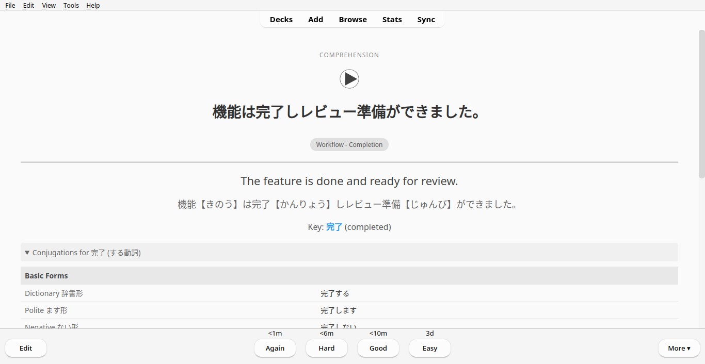

# nihongo-it-anki



Japanese IT vocabulary for Anki. 1000 sentences with AI-generated audio. Open source - build your own deck with the same tools.

## Download

**[AnkiWeb](https://ankiweb.net/shared/info/698107537)** - install directly from Anki app

**[GitHub Release](https://github.com/KakkoiDev/nihongo-it-anki/releases/latest/download/nihongo-it-vocab-complete.apkg)** (58 MB) - manual download

## What's Included

- 1000 IT vocabulary sentences across 6 difficulty tiers
- 2000 cards (comprehension + production for each sentence)
- AI-generated Japanese audio (Kokoro TTS) - natural-sounding, fully open source
- Furigana readings for all kanji
- Key vocabulary with English meanings
- Verb conjugation tables (collapsible, N1-level coverage)
- Dark mode support (automatic system theme detection)

## Card Types

**Comprehension** — Audio plays, read Japanese, reveal English translation + conjugation table

**Production** — See English, produce Japanese, check with audio

## Features

**Dark Mode** — Automatically matches your system theme preference

**Verb Conjugation Tables** — Collapsible tables on comprehension cards showing all conjugation forms:
- Basic forms (dictionary, polite, negative, te-form, past)
- Advanced forms (potential, passive, causative, conditional, volitional, imperative)
- Keigo forms (respectful, humble)
- Works for する verbs, godan/ichidan verbs, and い-adjectives

## Tiers

| Tier | Count | Level | Focus |
|------|-------|-------|-------|
| 1 | 150 | N5-N4 | Daily essentials, git, basic actions |
| 2 | 200 | N4-N3 | Agile, APIs, databases, testing |
| 3 | 250 | N3 | Code review, architecture, AWS |
| 4 | 200 | N3-N2 | Security, debugging, documentation |
| 5 | 100 | N2 | Communication, soft skills |
| 6 | 100 | N2-N1 | Presentations, advanced topics |

## Build From Source

Requires Python 3.13+, [uv](https://docs.astral.sh/uv/), and espeak-ng.

```bash
# Install dependencies
sudo apt-get install espeak-ng  # Ubuntu/Debian
brew install espeak             # macOS

# Clone and setup
git clone https://github.com/KakkoiDev/nihongo-it-anki.git
cd nihongo-it-anki
uv sync

# Generate audio (~2 hours for all tiers)
uv run python scripts/generate_audio.py --all

# Or generate with female voice
uv run python scripts/generate_audio.py --all --female

# Create deck
uv run python scripts/create_deck.py --combined

# Or create deck with female voice audio
uv run python scripts/create_deck.py --combined --female
```

## Scripts

| Script | Purpose |
|--------|---------|
| `generate_audio.py` | Generate TTS audio for sentences |
| `generate_conjugations.py` | Generate verb/adjective conjugation tables |
| `create_deck.py` | Create Anki .apkg files |
| `validate.py` | Validate CSVs and audio files |
| `pronunciation.py` | Furigana extraction, English→katakana |
| `add_key_meanings.py` | Generate English meanings for key words |

## Customization

**Use female voice** — Add `--female` flag to commands

```bash
uv run python scripts/generate_audio.py --all --female
uv run python scripts/create_deck.py --combined --female
```

| Voice | Type | Flag |
|-------|------|------|
| `jm_kumo` | Male | Default |
| `jf_alpha` | Female | `--female` |

**Modify cards** — Edit CSS in `scripts/create_deck.py`

**Add vocabulary** — Edit `tier{N}-vocabulary.csv`, regenerate audio and deck

## Known Limitations

### TTS Particle Pauses

Kokoro TTS sometimes links particles to the following word instead of the preceding word, making audio sound slightly unnatural. Mitigations:

- **を (object marker)**: Automatically handled. A comma is inserted after を (`を、`) for natural pauses.
- **が (subject marker)**: Requires manual comma insertion. When writing sentences, add a comma after が when it marks the subject (e.g., `バグが、発生しました` not `バグが発生しました`). This creates a natural pause in the TTS output.
- **は, に, で**: Sound natural without modification.

If using an LLM to generate sentences, instruct it to add commas after が when used as a subject marker particle.

## Credits

- [Kokoro TTS](https://github.com/hexgrad/kokoro) — Text-to-speech
- [genanki](https://github.com/kerrickstaley/genanki) — Anki deck generation

## License

MIT
