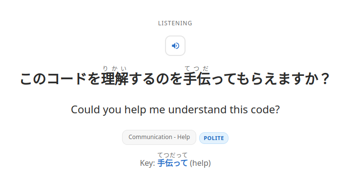

# nihongo-it-anki



Multi-deck Anki generator for IT Japanese. AI-generated audio, pitch accent coloring, and 3 card types designed for real workplace skill building. Open source.

## Decks

### IT Vocabulary (`it-vocab`)

1516 sentences across 15 tiers. Casual to keigo workplace Japanese for software engineers.

| Tier | Count | Focus |
|------|-------|-------|
| 1 | 150 | Daily essentials, git, basic actions |
| 2 | 200 | Agile, APIs, databases, testing |
| 3 | 250 | Code review, architecture, AWS |
| 4 | 200 | Security, debugging, documentation |
| 5 | 100 | Communication, soft skills |
| 6 | 115 | Presentations (including formal keigo) |
| 7 | 30 | Job interview (full keigo register) |
| 8 | 30 | Problem-solving discussions |
| 9 | 50 | AI & Agents |
| 10 | 51 | Documentation & Engineering Culture |
| 11 | 100 | Casual chat (plain-form Slack/huddle) |
| 12 | 100 | Live meetings (interrupting, clarifying, estimating) |
| 13 | 60 | Corporate life (attendance, expenses, reviews, 1on1) |
| 14 | 40 | Business email (keigo formulas) |
| 15 | 40 | Written tickets, commits, PRs (formal written register) |

### IT Kundoku (`it-kundoku`)

89 sentences across 3 tiers. Compressed single-kanji Japanese for token-efficient AI conversation.

| Tier | Count | Focus |
|------|-------|-------|
| 1 | 27 | Grammar - particles, connectors, conditionals |
| 2 | 24 | Actions - single-kanji verbs for code operations |
| 3 | 38 | Nouns, Descriptors & Patterns |

### Japanese Accounting (`accounting`)

129 sentences across 9 tiers. Money/accounting vocabulary for a construction-industry ERP - enough to read and discuss the sales/cost/closing flow with Japanese colleagues. All readings verified against UniDic.

| Tier | Count | Focus |
|------|-------|-------|
| 1 | 18 | Business flow - order, delivery, acceptance, billing |
| 2 | 11 | Recognition - sales/cost recognition, bookkeeping |
| 3 | 12 | Journals & accounts - debit/credit, ledgers, entries |
| 4 | 16 | Parties, billing & collection - bill-to, reconciliation |
| 5 | 16 | Balances & adjustments - AR/AP, offset, WIP |
| 6 | 14 | Closing & periods - period lock, carry-over |
| 7 | 17 | Standards, tax & compliance - recognition standard, invoice system |
| 8 | 13 | Construction cost & inventory - WIP, cost allocation |
| 9 | 12 | Discussion phrases - talking through the flow |

### Japanese Home Ownership (`fudosan`)

180 sentences across 12 tiers. 不動産・住宅購入 - the Japanese you need to buy land and build on it: phoning agents, reading listings, surviving the zoning and tax vocabulary, and asking city hall the right question. Mostly polite and keigo, with a written register for the language that only ever appears on contracts and municipal forms. All readings verified against UniDic.

| Tier | Count | Focus |
|------|-------|-------|
| 1 | 15 | Phone basics - first call to an agent |
| 2 | 15 | Phone advanced - zoning, road and utility questions |
| 3 | 15 | Property listings - reading the basic figures |
| 4 | 15 | Listings advanced - boundaries, title, buried obstacles |
| 5 | 15 | Regulation basics - city planning areas, building standards |
| 6 | 15 | Roads & regulation advanced - frontage, setback, forest law |
| 7 | 15 | Tax basics - acquisition and fixed asset tax |
| 8 | 15 | Tax advanced - reductions, filing, valuation |
| 9 | 15 | City hall basics - reaching the right desk |
| 10 | 15 | City hall advanced - asking for a ruling |
| 11 | 15 | Pitfalls basics - the costs nobody quotes you |
| 12 | 15 | Pitfalls advanced - unregistered buildings, common rights |

### Agentic Lab Priority Path (`agentic-lab`)

179 sentences across 5 tiers, every one of them re-used from `it-vocab`. A short
runway into an all-Japanese engineering team: recovery phrases first, meeting
structure second, the plain form you actually hear third, and subject-matter
vocabulary deliberately last. The selection and its rationale live in
[docs/PRIORITY-PATH-agentic-lab.md](docs/PRIORITY-PATH-agentic-lab.md).

Note GUIDs are namespaced, so this deck and `it-vocab` can be installed together
and scheduled independently.

| Tier | Count | Focus |
|------|-------|-------|
| 1 | 14 | The survival set - keeping a conversation alive after comprehension fails |
| 2 | 44 | Meeting structure - openings, progress, estimates, parking a topic |
| 3 | 66 | Plain form, huddles and Slack - the register the polite tiers skip |
| 4 | 28 | Opinions, blockers and analysis - contributing rather than following |
| 5 | 27 | Explaining and deciding - structural connectives |

## Download

**[AnkiWeb](https://ankiweb.net/shared/info/698107537)** - install IT Vocabulary directly from Anki app

**[GitHub Release](https://github.com/KakkoiDev/nihongo-it-anki/releases/latest/download/it-vocab-complete.apkg)** - manual download

## Project Structure

```
decks/
  it-vocab/           # IT Vocabulary deck (15 tiers, 1516 sentences)
    deck.toml         # Deck config (name, IDs, tier definitions)
    translations.py   # Cloze word translations
    tier{1-15}-vocabulary.csv
  it-kundoku/         # IT Kundoku deck (3 tiers, 89 sentences)
    deck.toml
    translations.py
    tier{1-3}-vocabulary.csv
  accounting/         # Japanese Accounting deck (9 tiers, 129 sentences)
    deck.toml
    translations.py
    pronunciation_overrides.py   # readings that legitimately differ from UniDic
    tier{1-9}-vocabulary.csv
  fudosan/            # Japanese Home Ownership deck (12 tiers, 180 sentences)
    deck.toml
    pronunciation_overrides.py   # compound readings UniDic splits and mis-reads
    tier{1-12}-vocabulary.csv
  agentic-lab/        # Agentic Lab Priority Path (5 tiers, 179 sentences)
    deck.toml         # guid_namespace set: every sentence is also in it-vocab
    tier{1-5}-vocabulary.csv
scripts/
  lib/config.py       # DeckConfig dataclass + loader
  create_deck.py      # Create Anki .apkg files
  generate_audio.py   # Generate TTS audio
  generate_pitch_accent.py  # Pitch accent from UniDic
  validate.py         # Validate CSVs and audio
  pronunciation.py    # TTS preprocessing (shared)
  add_key_meanings.py # Generate English meanings
  test_tts.py         # Quick TTS test
skills/
  it-kundoku/         # Claude Code skill for IT Kundoku mode
tests/
```

## Card Types

**Listening** - Audio-only front. No text. Forces pure listening comprehension for meetings and standups.

**Reading** - Japanese text front, no audio. Trains reading for Slack, PRs, and documentation.

**Vocabulary** - Key word blanked in sentence with English hint. Tests one word at a time.

## Features

- Pitch accent coloring (green=high, red=low) on key vocabulary
- Register badges (polite/keigo) on card fronts
- Neural TTS audio (Microsoft Edge ja-JP-KeitaNeural)
- Dark mode support
- Multi-deck support with shared pipeline

## Build From Source

Requires Python 3.13+ and [uv](https://docs.astral.sh/uv/).

```bash
git clone https://github.com/KakkoiDev/nihongo-it-anki.git
cd nihongo-it-anki
uv sync

# List available decks
uv run python scripts/create_deck.py --list-decks

# Generate audio for a deck
uv run python scripts/generate_audio.py --deck it-vocab --all

# Create deck
uv run python scripts/create_deck.py --deck it-vocab --combined

# Female voice
uv run python scripts/generate_audio.py --deck it-vocab --all --female
uv run python scripts/create_deck.py --deck it-vocab --combined --female
```

All scripts accept `--deck <slug>` (defaults to `it-vocab`).

### Releasing

Each deck is released independently with its own version tag (`{deck}/{version}`):

```bash
# Preview what will be released
uv run python scripts/release.py --deck it-vocab --version v5.1 --dry-run

# Create releases
uv run python scripts/release.py --deck it-vocab --version v5.1 --title "Tiers 13-15 + audit fixes"
uv run python scripts/release.py --deck it-kundoku --version v1.0 --title "Initial release"

# Draft release (not published)
uv run python scripts/release.py --deck it-kundoku --version v1.0 --draft

# Release notes from file
uv run python scripts/release.py --deck it-vocab --version v5.1 --notes-file RELEASE.md
```

Assets attached: `{slug}-complete.apkg` + individual `{slug}-tier{N}.apkg` files.

## Scripts

| Script | Purpose |
|--------|---------|
| `create_deck.py` | Create Anki .apkg files |
| `generate_audio.py` | Generate TTS audio for sentences |
| `generate_pitch_accent.py` | Generate pitch accent data from UniDic |
| `check_pronunciation.py` | Verify furigana readings against the UniDic dictionary (standard pronunciation check) |
| `validate.py` | Validate CSVs and audio files (runs `check_pronunciation` in advisory mode) |
| `pronunciation.py` | Furigana extraction, English-to-katakana conversion, TTS prosodic fixes |
| `add_key_meanings.py` | Generate English meanings for key words |
| `test_tts.py` | Generate audio for one or more rows to test pronunciation changes |
| `release.py` | Create GitHub releases per deck |
| `migrate_guids.py` | Migrate existing Anki collections from random GUIDs to stable sentence-based GUIDs. One-time fix for users who imported pre-stable-GUID builds. |
| `migrate_deck_names.py` | Rename subdecks in `collection.anki2` from `Tier N` to `Tier 0N`. Detects orphan subdecks and can delete them with `--delete-orphans`. |

## Documentation

Deeper docs live under [`docs/`](docs/):

- [`docs/tts-audio-debugging.md`](docs/tts-audio-debugging.md) - ASR-based audit methodology, Edge TTS bug taxonomy, fix workflow, false-positive filtering. Read this if you hear a card audio that sounds wrong.
- [`docs/MIGRATE-DECK-NAMES.md`](docs/MIGRATE-DECK-NAMES.md) - DB-level Anki migration guide covering both `migrate_deck_names.py` (subdeck rename + orphan cleanup) and `migrate_guids.py` (GUID + model-id retarget). Read this if you're upgrading an existing Anki collection.
- [`docs/REPORT-DECK-MIGRATION.md`](docs/REPORT-DECK-MIGRATION.md) - Postmortem of the 2026-04-21 GUID + model-id live recovery. Anki schema gotchas (zstd anki21b, unicase collation, orphan note types, AnkiWeb sync divergence).

## Skills

### IT Kundoku

Claude Code skill for compressed IT Japanese communication. Install:

```bash
ln -sf "$(pwd)/skills/it-kundoku" ~/.claude/skills/it-kundoku
```

Trigger with `/it-kundoku`. Uses single-kanji vocabulary with Japanese readings and minimal grammar for token-efficient technical discussion.

## Adding a New Deck

1. Create `decks/<slug>/deck.toml` with unique `model_id` and `deck_base_id`
2. Add `tier{N}-vocabulary.csv` files
3. Add `translations.py` for KeyMeaning
4. Run: `uv run python scripts/create_deck.py --deck <slug> --combined`

## Credits

- [Edge TTS](https://github.com/rany2/edge-tts) - Text-to-speech (Microsoft Edge neural voices)
- [genanki](https://github.com/kerrickstaley/genanki) - Anki deck generation

## License

MIT
